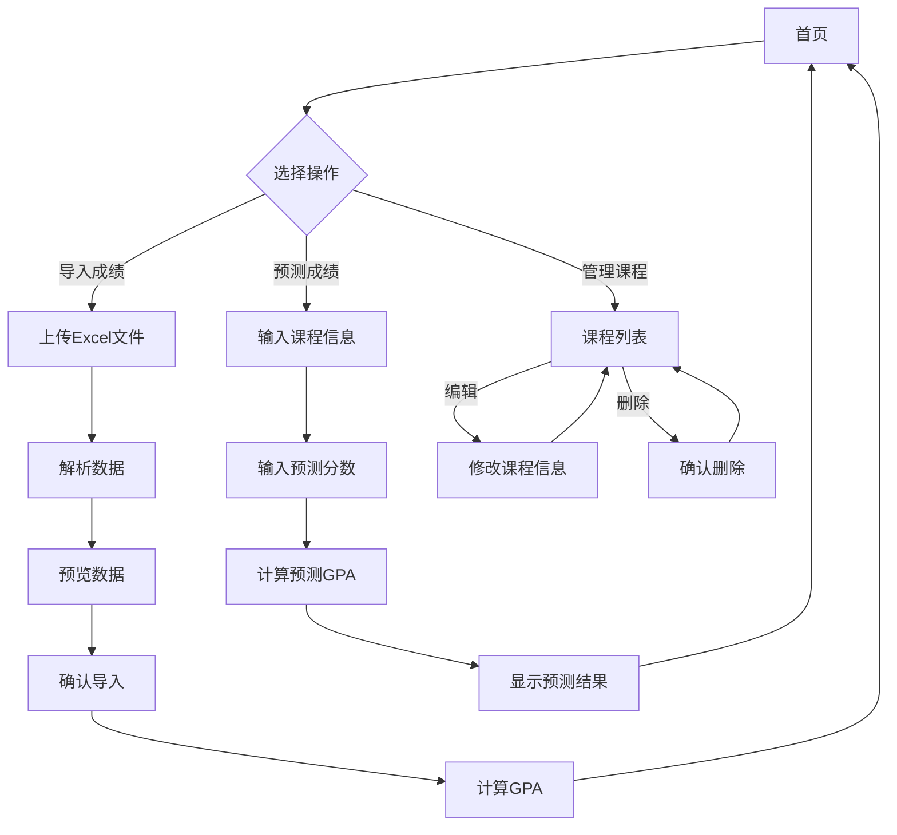

## 1. Product Overview
教务辅助系统是一个帮助学生计算和预测GPA的工具网站，支持导入学校教务系统导出的Excel成绩表格，自动计算加权平均学分绩点，并提供成绩预测功能。
- 解决学生无法快速计算GPA和预测新成绩影响的痛点
- 目标用户为在校大学生，帮助他们更好地规划学业

## 2. Core Features

### 2.1 User Roles
| Role | Registration Method | Core Permissions |
|------|---------------------|------------------|
| 普通用户 | 无需注册 | 导入成绩、计算GPA、预测成绩、管理课程数据 |

### 2.2 Feature Module
1. **首页（Dashboard）**: 展示当前GPA、课程统计、成绩分布
2. **成绩导入页**: 导入Excel成绩表格，自动解析课程信息
3. **成绩预测页**: 输入预测成绩，计算对GPA的影响
4. **课程管理页**: 查看和管理已导入的课程数据

### 2.3 Page Details
| Page Name | Module Name | Feature description |
|-----------|-------------|---------------------|
| 首页 | 数据概览 | 显示当前加权平均学分绩点、总学分、课程数量、成绩分布图表 |
| 首页 | 快速操作 | 提供导入成绩、预测成绩的快捷入口 |
| 成绩导入页 | 文件上传 | 支持拖拽或点击上传Excel文件(.xlsx, .xls) |
| 成绩导入页 | 数据预览 | 预览解析后的课程数据，支持手动修正 |
| 成绩导入页 | 导入确认 | 确认导入并自动计算GPA |
| 成绩预测页 | 预测输入 | 输入课程名称、学分、课程类型、预测分数 |
| 成绩预测页 | 影响分析 | 显示预测后的GPA变化、新增学分等信息 |
| 课程管理页 | 课程列表 | 展示所有已导入课程，支持分页 |
| 课程管理页 | 编辑删除 | 支持编辑课程信息、删除课程 |

## 3. Core Process

### 3.1 成绩导入流程
1. 用户点击"导入成绩"按钮
2. 选择或拖拽Excel文件上传
3. 系统解析Excel文件，提取课程名称、学分、课程类型、成绩等信息
4. 用户预览解析结果，可修改错误数据
5. 点击确认导入，系统计算GPA并保存数据

### 3.2 成绩预测流程
1. 用户点击"预测成绩"按钮
2. 输入待预测课程的信息（课程名称、学分、课程类型、预测分数）
3. 系统根据2024年秋季学期及以后的绩点计算规则，预测GPA变化
4. 显示预测结果，包括新GPA、变化幅度等

### 3.3 流程图表

## 4. User Interface Design

### 4.1 Design Style
- **主色调**: 深蓝色 (#1e3a5f) 配合清新的青色 (#00d4ff) 作为强调色
- **辅助色**: 浅绿色 (#00ff88) 用于成功状态，橙红色 (#ff6b35) 用于警告/错误状态
- **按钮风格**: 圆角矩形，渐变背景，悬停时轻微放大和阴影效果
- **字体**: 使用"Noto Sans SC"作为主要字体，清晰易读
- **布局风格**: 卡片式布局，清晰的信息层级
- **图标**: 使用Lucide React图标库

### 4.2 Page Design Overview
| Page Name | Module Name | UI Elements |
|-----------|-------------|-------------|
| 首页 | Hero区域 | 大标题"GPA计算器"，副标题"轻松计算和预测你的绩点"，主按钮"立即导入成绩" |
| 首页 | 数据卡片 | GPA显示卡片（大号数字、颜色渐变），学分统计卡片，课程数量卡片 |
| 首页 | 图表区域 | 成绩分布饼图或柱状图 |
| 首页 | 最近课程 | 最近导入的课程列表，显示课程名、分数、绩点 |
| 成绩导入页 | 上传区域 | 大尺寸上传框，支持拖拽，显示文件类型提示 |
| 成绩导入页 | 数据表格 | 解析后的课程数据表格，支持内联编辑 |
| 成绩预测页 | 表单区域 | 课程信息输入表单，包含课程名称、学分、类型、分数选择 |
| 成绩预测页 | 结果区域 | 预测结果卡片，显示新旧GPA对比、变化趋势 |
| 课程管理页 | 表格区域 | 课程列表表格，支持筛选和搜索 |

### 4.3 Responsiveness
- **桌面端**: 多栏布局，充分利用屏幕空间
- **平板端**: 自适应两栏布局
- **移动端**: 单列布局，卡片堆叠，优化触摸操作

### 4.4 绩点计算规则（2024年秋季学期及以后）
根据用户提供的计算规则：
- **加权平均学分绩点** = ∑[(非学位课绩点×非学位课学分)+(学位课绩点×学位课学分×1.2)] / ∑[非学位课学分+学位课学分×1.2]
- **百分制与绩点对应关系**:
  - 97-100: A+, 4.5
  - 93-96: A, 4.3
  - 89-92: A-, 4.0
  - 85-88: B+, 3.8
  - 81-84: B, 3.4
  - 77-80: B-, 3.0
  - 73-76: C+, 2.6
  - 69-72: C, 2.2
  - 65-68: C-, 1.8
  - 60-64: D, 1.2
  - 40-59: F, 0
  - 0-39: F-, 0
