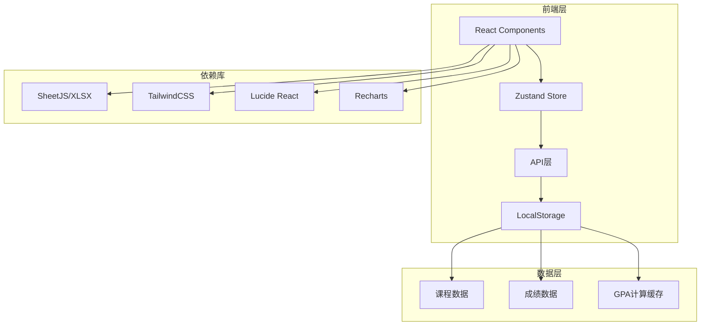
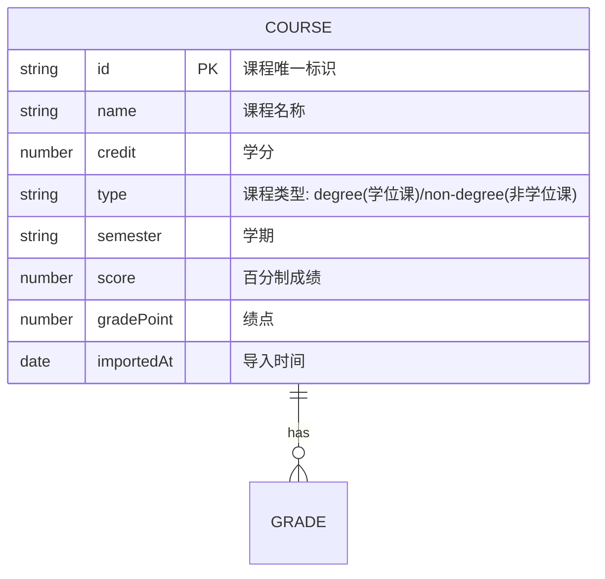

## 1. Architecture Design



## 2. Technology Description

* **Frontend**: React\@18 + TypeScript + TailwindCSS\@3 + Vite

* **Initialization Tool**: vite-init

* **Backend**: None (纯前端应用，数据存储在LocalStorage)

* **State Management**: Zustand

* **Excel处理**: SheetJS (xlsx库)

* **图表库**: Recharts

* **图标库**: Lucide React

## 3. Route Definitions

| Route    | Purpose     | Component        |
| -------- | ----------- | ---------------- |
| /        | 首页Dashboard | Dashboard        |
| /import  | 成绩导入页       | ImportPage       |
| /predict | 成绩预测页       | PredictPage      |
| /courses | 课程管理页       | CourseManagement |

## 4. API Definitions

本项目为纯前端应用，无需后端API。数据通过LocalStorage进行持久化存储。

## 5. Data Model

### 5.1 数据模型定义



### 5.2 数据类型定义

```typescript
interface Course {
  id: string;
  name: string;
  credit: number;
  type: 'degree' | 'non-degree';
  semester: string;
  score: number;
  gradePoint: number;
  importedAt: number;
}

interface GPAResult {
  gpa: number;
  totalWeightedScore: number;
  totalWeightedCredits: number;
  degreeCourses: Course[];
  nonDegreeCourses: Course[];
}

interface PredictInput {
  name: string;
  credit: number;
  type: 'degree' | 'non-degree';
  predictedScore: number;
}

interface PredictResult {
  currentGPA: number;
  predictedGPA: number;
  change: number;
  predictedCourse: Course;
}
```

### 5.3 绩点计算工具函数

```typescript
// 根据百分制成绩获取绩点（2024年秋季学期及以后规则）
function getGradePoint(score: number): number

// 计算加权平均学分绩点
function calculateGPA(courses: Course[]): GPAResult

// 预测新增成绩对GPA的影响
function predictGPA(courses: Course[], predictInput: PredictInput): PredictResult
```

## 6. Project Structure

```
src/
├── components/
│   ├── layout/
│   │   ├── Header.tsx
│   │   └── Sidebar.tsx
│   ├── dashboard/
│   │   ├── GPACard.tsx
│   │   ├── StatsCard.tsx
│   │   └── GradeDistribution.tsx
│   ├── import/
│   │   ├── FileUploader.tsx
│   │   └── DataPreview.tsx
│   ├── predict/
│   │   ├── PredictForm.tsx
│   │   └── PredictResult.tsx
│   └── courses/
│       ├── CourseTable.tsx
│       └── CourseEditModal.tsx
├── pages/
│   ├── Dashboard.tsx
│   ├── ImportPage.tsx
│   ├── PredictPage.tsx
│   └── CourseManagement.tsx
├── store/
│   └── courseStore.ts
├── utils/
│   ├── gpaCalculator.ts
│   └── excelParser.ts
├── types/
│   └── index.ts
├── App.tsx
├── main.tsx
└── index.css
```

## 7. 关键实现细节

### 7.1 Excel解析

* 使用SheetJS库读取Excel文件

* 支持.xlsx和.xls格式

* 自动识别常见的教务系统Excel格式

* 提取字段：课程名称、学分、课程类型、成绩、学期

### 7.2 绩点计算规则（2024年秋季学期及以后）

* **公式**: 加权平均学分绩点 = ∑\[(非学位课绩点×非学位课学分)+(学位课绩点×学位课学分×1.2)] / ∑\[非学位课学分+学位课学分×1.2]

* **百分制与绩点映射**:

  * 97-100: 4.5

  * 93-96: 4.3

  * 89-92: 4.0

  * 85-88: 3.8

  * 81-84: 3.4

  * 77-80: 3.0

  * 73-76: 2.6

  * 69-72: 2.2

  * 65-68: 1.8

  * 60-64: 1.2

  * 40-59: 0

  * 0-39: 0

### 7.3 数据持久化

* 使用LocalStorage存储课程数据

* 数据结构：`{ courses: Course[], lastUpdated: number }`

* 每次导入或修改后自动保存

## 8. 性能优化

* 使用Zustand进行状态管理，避免不必要的渲染

* 数据缓存策略，避免重复计算GPA

* 懒加载图表组件，减少首屏加载时间

* 响应式设计，优化移动端体验

